---

# منصة المخازن الإلكترونية

### ملخص المشروع
 منصة إحالة الشحن (Drop Shipping) هي مخازن الإلكترونية شاملة لأصحاب المتاجر الإلكترونية، يمكنهم اختيار المنتجات التي يريدون بيعها في متاجرهم عبر الإنترنت وعرض قوائم المنتجات بالصور والمعلومات ويتم استقبال الطلبات من خلال خدمة الربط الآلي وتوفير خدمة التغليف والشحن.

 إحالة الشحن، وهو جزء من التجارة الإلكترونية، هو استراتيجية يقوم فيها البائع عبر الإنترنت بعرض المنتجات وعرضها دون الحاجة إلى الاحتفاظ بها في المخزون، بحيث عندما يقوم المشتري بالشراء، يتم إرسال الطلبات وتسليمها مباشرة من مرافق إحالة الشحن.

 بمعنى آخر، إنها استراتيجية إدارة حيث لا يحتفظ بائع التجزئة بالسلع في المخزون، بل ينقل الطلبات وتفاصيل التسليم التي يتلقاها من العملاء إلى الشركة المصنعة، أو بائع تجزئة آخر، أو تاجر الجملة الذي يقوم بعد ذلك بتسليم البضائع مباشرة إلى العميل.

---

## المتطلبات

### المتطلبات الأساسية
- **اللغة البرمجية**: PHP (Laravel).
- **قاعدة البيانات**: MySQL.
- **العمليات التقنية**:
  - RestAPI
  - AJAX
- **البيئة المطلوبة**:
  - PHP 7.4 أو أعلى.
  - Composer لإدارة الحزم.
  - خادم محلي مثل XAMPP أو LAMP.

---

### بعض المتطلبات الوظيفية للنظام

#### 1. واجهة الهبوط (الرئيسية)  
يوفر الموقع واجهة رائيسية تتكون من الرئيسية ومعلومات عنا والخدمات وتواصل معانا وتسجيل الدخول و انشاء حساب 
* **عرض الصورة**:


* **عرض الصورة**:


* **عرض الصورة**:


* **عرض الصورة**:


#### 2. إنشاء حساب 
يتيح للمستخدمين إنشاء حسابات جديدة. 
* **المدخلات**: ID، اسم المستخدم، البريد الإلكتروني، الهاتف، كلمة المرور، الصلاحية (مثل مدير النظام أو تاجر).
* **عرض الصورة**:


#### 3. تسجيل الدخول
يجب أن يوفر النظام واجهة لتسجيل الدخول للمستخدمين باستخدام البريد الإلكتروني وكلمة المرور.
* **عرض الصورة**:
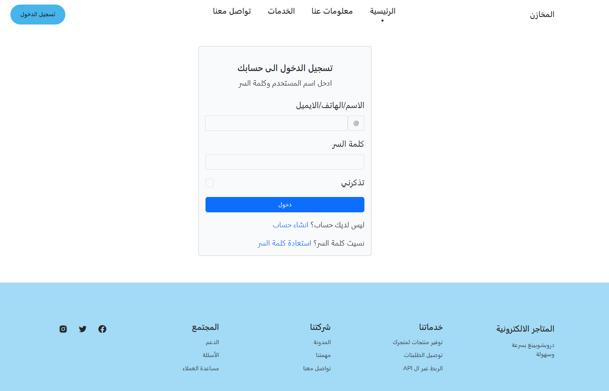

#### 4. تحديث بيانات الحساب 
يتيح النظام للمستخدمين تحديث البيانات مثل اسم المستخدم، البريد الإلكتروني، الهاتف، وكلمة المرور.
* **عرض الصورة**:
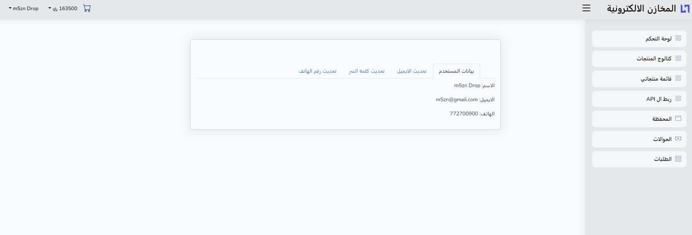

#### 5. لوحة التحكم
يتيح النظام عرض لوحة تحكم يوجد فيها ملخص واحصائيات تختلف بحسب الصلاحية.
* **عرض الصورة**:


* **عرض الصورة**:
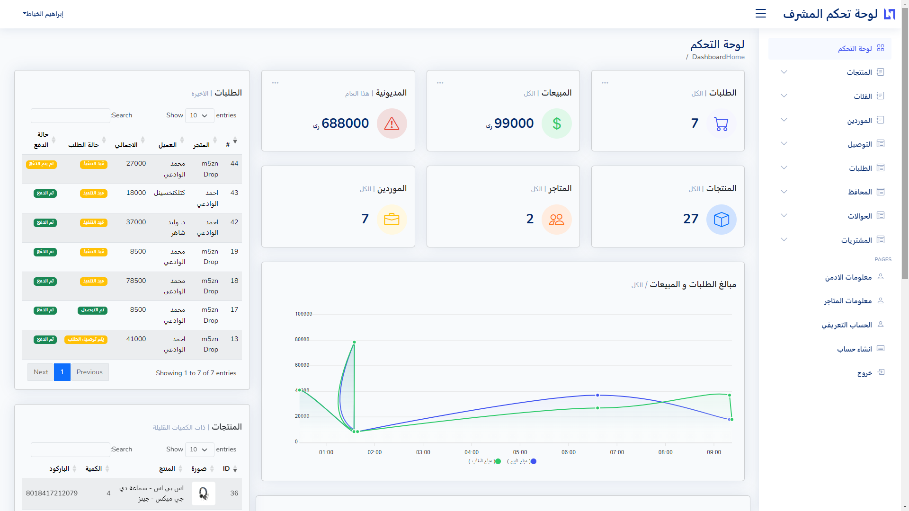

* **عرض الصورة**:


#### 6. إدارة الموردين
يمكن للمشرفين إضافة وتحديث وإدارة الموردين ورصيدهم.
* **عرض الصورة**:
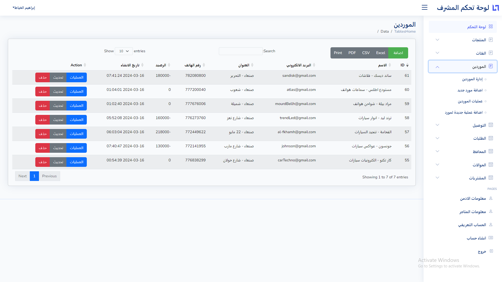

#### 7. إدارة الفئات
يتيح النظام إضافة فئات رئيسية وفرعية وإدارتها.
* **عرض الصورة**:


#### 8. إضافة وإدارة المنتجات
يتيح النظام إضافة منتجات جديدة وتعديلها وحذفها.
* **عرض الصورة**:


* **عرض الصورة**:


#### 9.  عرض المنتجات
يتيح النظام عرض منتجات واضافتها لسلة التاجر.
* **عرض الصورة**:
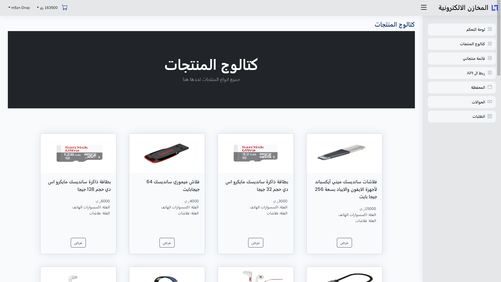

#### 10.   منتجاتي
يتيح النظام عرض منتجات اللتي تم قام بإضافتها التاجر وادارتها.
* **عرض الصورة**:
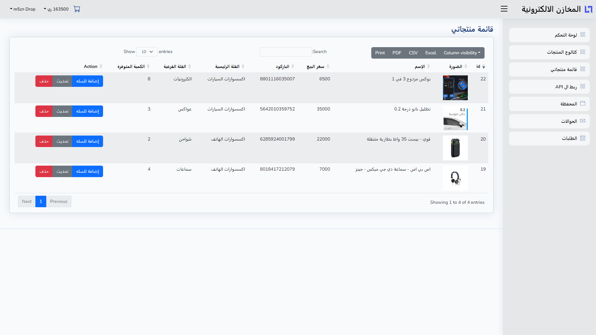

#### 11.  المحفظة
يتيح النظام اضافة محفظة لكل حساب وادارة عملياتها.
* **عرض الصورة**:


#### 12.  الحولات
يتيح النظام اضافة حواله للمستخدمين و يسمح للمشرف مراجعتهاوادارتها .
* **عرض الصورة**:
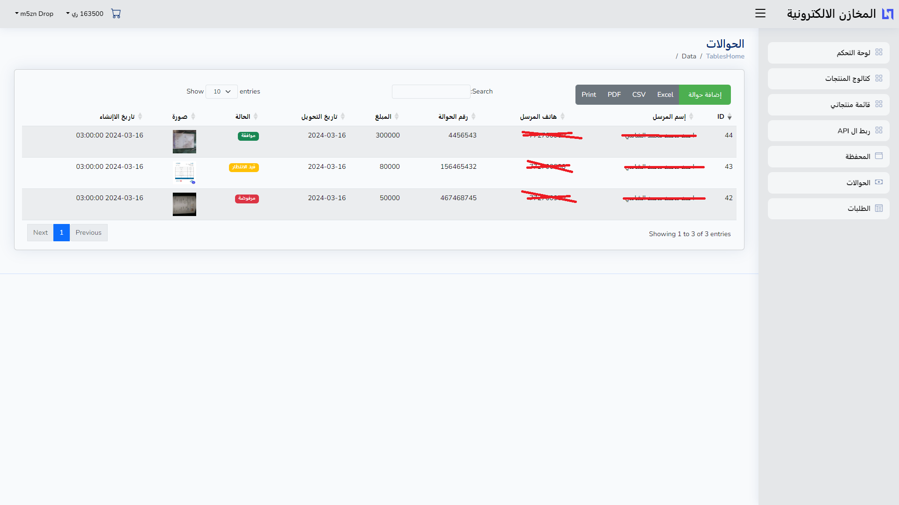

* **عرض الصورة**:


#### 13.  ريط API
يتيح النظام للمتاجر ربط المنصة مع متاجرهم الالكترونية لعرض المنتجات في متاجرهم و استقبال الطلبات.
* **عرض الصورة**:


#### 14. إضافة فاتورة مشتريات وإدارتها
يسمح النظام بإضافة فاتورة مشتريات وتحديث معلوماتها.
* **عرض الصورة**:
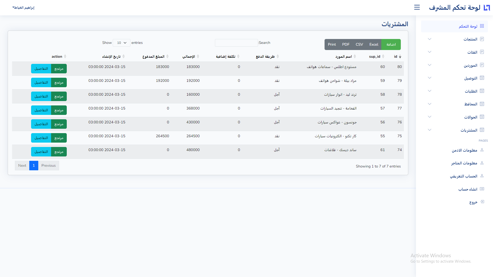

* **عرض الصورة**:
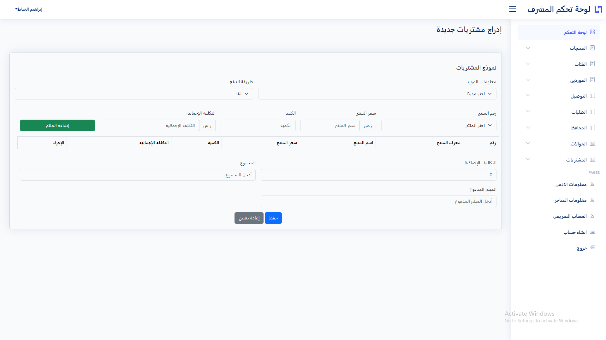

#### 15. إدارة المرتجعات للمشتريات
يتيح إضافة مرتجع لفاتورة مشتريات، مع تسجيل كل منتج وكمية المرتجع.
* **عرض الصورة**:
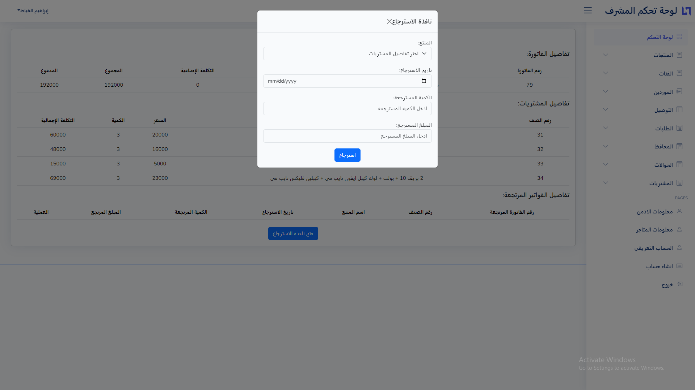

#### 16. التوصيل
يتيح النظام اضافة وعرض بيانات طرق التوصيل الموجودةوعرض شامل وتحديث طرق التوصيل.
* **عرض الصورة**:
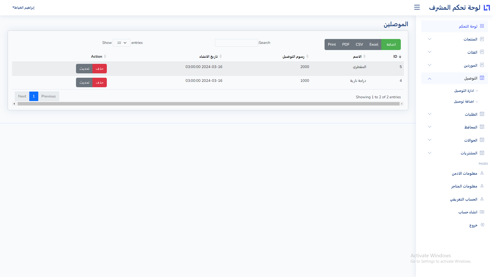

#### 17. إدارة الطلبات
يعرض الطلبات ويتيح للمشرف التحكم بها وتحديث تفاصيل المنتجات والعميل.
* **عرض الصورة**:


* **عرض الصورة**:
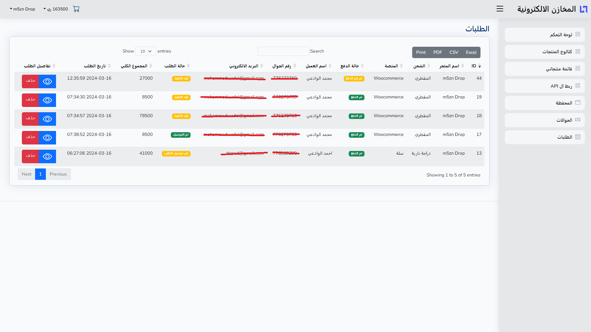

* **عرض الصورة**:
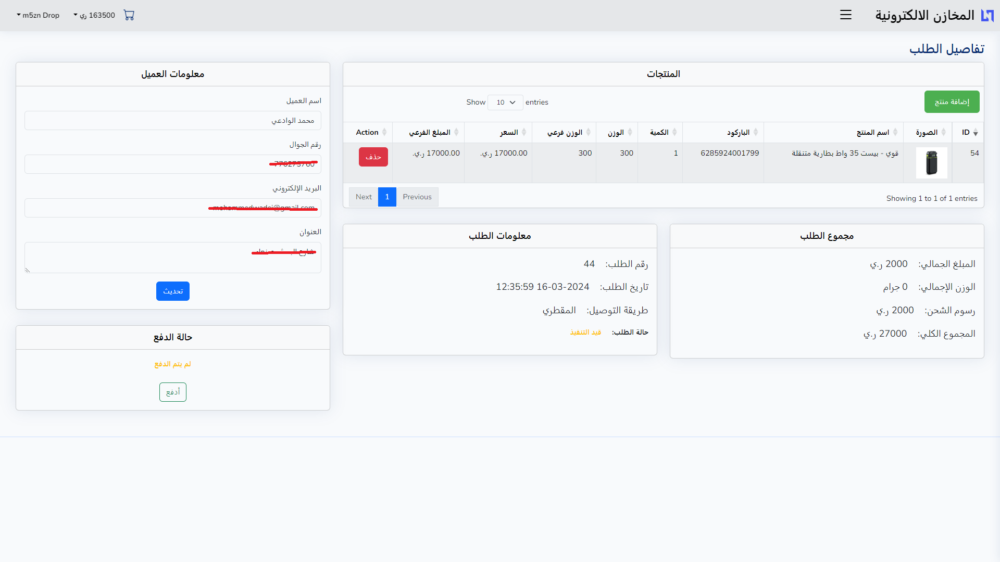

---

## كيفية التثبيت والاستخدام

1. **نسخ المستودع**
   ```bash
   git clone https://github.com/ibrahim-k7/Graduation-Project-Dropshipping-platform-Laravel9.git
   cd Graduation-Project-Dropshipping-platform-Laravel9
   ```

2. **تثبيت الحزم باستخدام Composer**
   ```bash
   composer install
   ```

3. **إعداد قاعدة البيانات**
   - قم بإنشاء قاعدة بيانات جديدة في MySQL.
   - قم بستيراد قاعدة البيانات التي داخل ملف المشروع
   - قم بتحديث ملف `.env` بمعلومات قاعدة البيانات الخاصة بك.
   ```plaintext
   DB_CONNECTION=mysql
   DB_HOST=127.0.0.1
   DB_PORT=3306
   DB_DATABASE=m5azen
   DB_USERNAME=root
   DB_PASSWORD=password
   ```


4. **تشغيل الخادم المحلي**
   ```bash
   php artisan serve
   ```

---

## المساهمة
لتقديم مساهمات، قم بفتح فرع جديد وتقديم طلب سحب، مع تحيات المهندس ابراهيم (:.

